## 180602洋山自动化码头见闻随想

---

6.2一大早，一行人在张氢老师及助教的带领下驱车前往位于上海市东南方位的洋山港，一块位于杭州湾长江入海口不远的小小飞地；然而在那里这块天然良港不仅是中国乃至亚洲第一大港，更是全球货物吞吐量最大的港口。

### **1.启程**

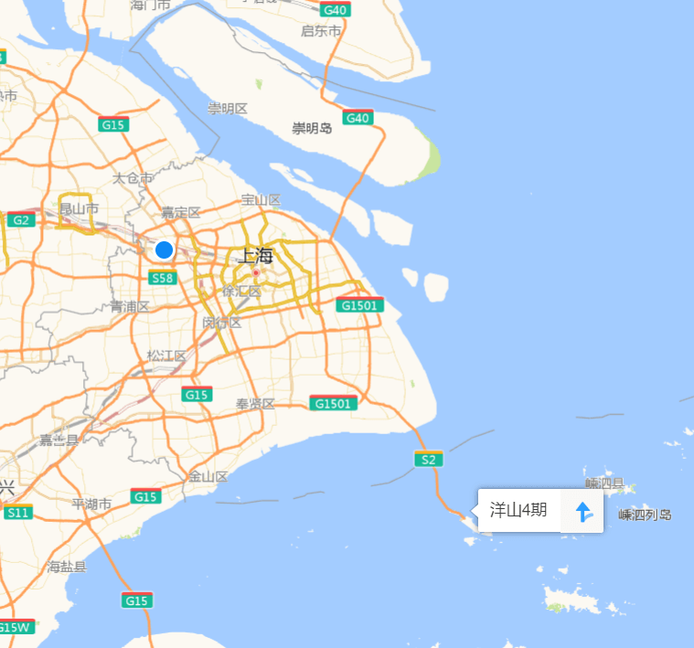

伴随着一个小时多的车程，我们到达了通往洋山港之旅的最重要一站——东海大桥。这座起始于上海市浦东新区，南跨杭州湾北部海域，直达嵊泗县小洋山岛的大桥与02年开工，历经三年完成与05年正式通车，极大地促进了洋山港在近十年来的兴起与蓬勃发展。边看那卫星地图中十分渺小，边感受在波涛不止的大海上矗立着这样一座伟大的工程，真是令人不得不称奇啊！

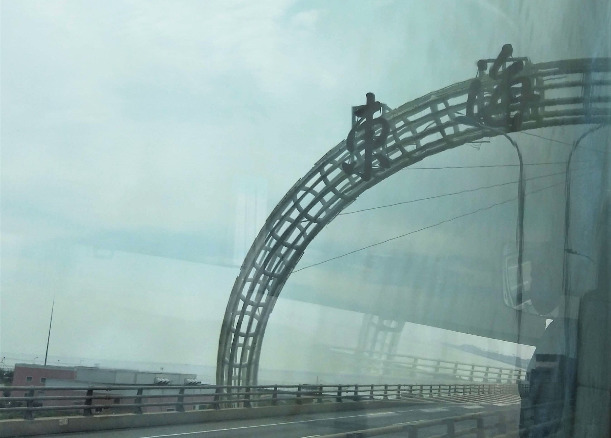

在东海大桥中段的位置，抬起头向左右两边查看，可以注意到成片的海上风力发电机，这亦是本门课所涉及到的课题之一，一方面很感谢这门课可以邀请到来自振华重工的各位工程师“导论式”的为我们讲解了各类港口与海洋工程，一方面也能通过实地考察的方式去真正了解工程背后的复杂性。

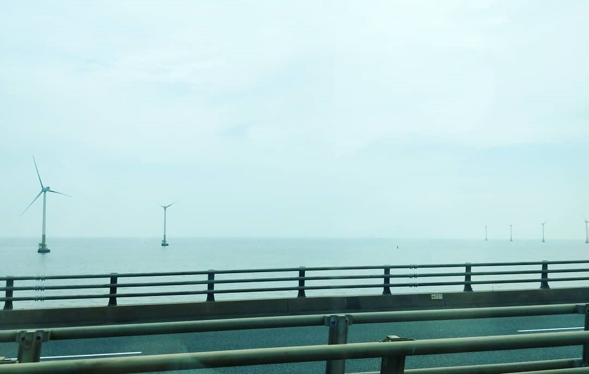

### **2.参观**

> 本过程主要遵循一个大巴跟循引导车的见闻顺序一一论说。

#### 2.1整体规划与设计

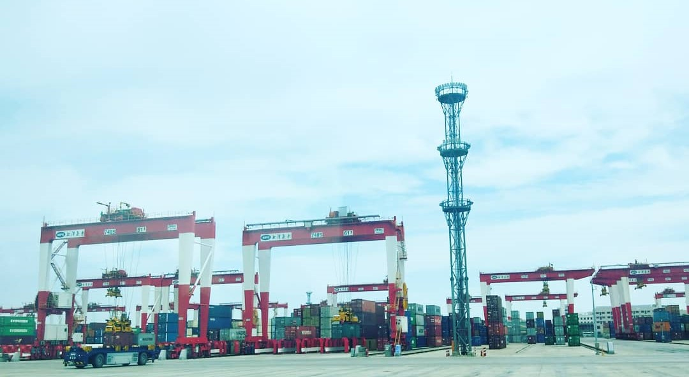

深水岸线和土地是建设深水集装箱港口所必备的资源，对于洋山港这样一个远离大陆、外海岛礁环境下建设的港口土地显得尤为珍贵，其码头岸线深入外海，土地均由深海填筑形成，这对于整个码头的规划提出了挑战。

参观时可以发现——洋山四期工程陆域横向宽度大，但纵深狭小，且后方紧贴连接上海与洋山的东海大桥。经介绍，几年前来自振华重工的工程师根据环境等限制条件进行特殊布局规划，确立了“双小车岸桥+AGV+ARMG”装卸工艺，将相对短小的纵深由里到外分为行驶、缓冲与装卸区，中间穿插办公楼、配电站、充电区等设计，达达提高了效率。

在随后登山洋山港观景台与旧码头对比并结合相关媒体报道可以总结出，自动化码头接受程度越来越好，主要从**环保与安全**两方面体现——一方面，几乎全电动化的机械运转大大减少了废气排放，保证了码头港区的整洁，更为相关人员提供了一个较为舒适的工作环境；另一方面，AGV取代了集卡，24小时不间断的运输中由于集卡数量的大大减少，从而极大的避免了由于司机工作精神不佳而造成的事故，并且自动规划与调度实现了港区交通的合理与可通行。关于上述这点，带领我们的工作人员说到“如果不是自动化码头，一来空气太脏不好进入，二来会交通混乱引起拥堵”。

当然，环保与安全带来的是投资的加大与提高，但我认为这是必须也必要的，环保整治从能源上切断，将会大大减少因为污染带来的二次投入，而安全，人命关天，出了事故人身安全使用金钱也换不回来的。更何况，当洋山四期自动化码头作为第四代自动化码头的典型越来越国内外所知，将整体方案与机电设备推向世界后所得到回报远远是值得的。

#### 2.2大型工程设备的运转

**1) 龙门起重机与集卡的安装交互**

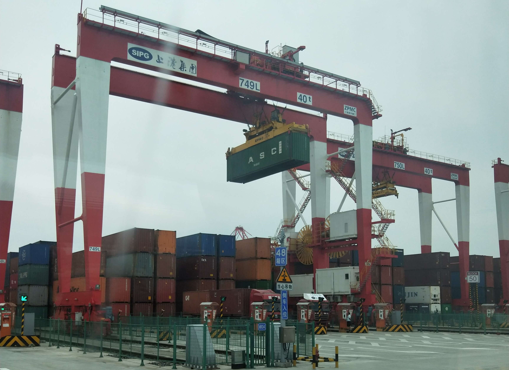

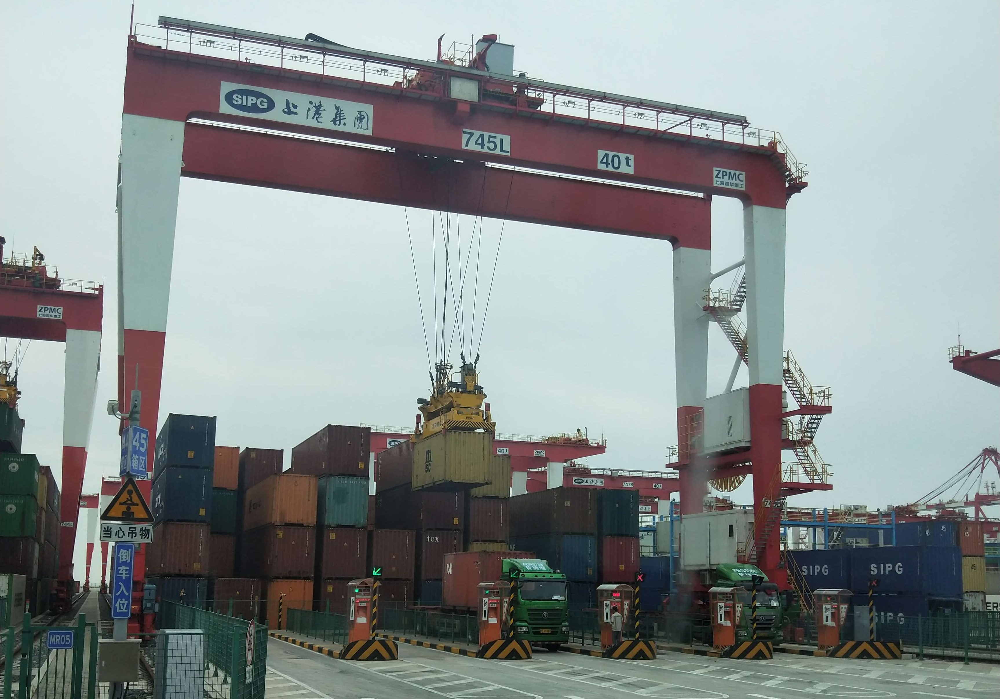

一个集装箱从远洋货轮转移到陆路运输需要多个环节，而这一切都由“桥”“台”“吊”组成的“巨型机器人”协同完成。

“桥”是岸桥，它是码头前沿生产装卸的主力军。洋山四期投产了近十台岸桥，其中7台主要用于大型干线船舶作业，起升高度49米，外伸距可达70米，；“台”是岸桥中转平台，在这里安装机械臂和传送装置后，可以对集装箱锁钮进行全自动拆装；“吊”是轨道吊，主要用于堆场作业，与AGV小车和集装箱卡车进行作业交互。

而上述两图正是轨道吊车在扫描二维码后，移动集装箱并对集卡进行安装的过程，经工作人员的提醒可知，这一过程中唯一有人为干预的就是安全检查，这大大提高了安装效率，同时保证了安全与可靠性。

**2) 岸桥起重机与巨型货轮**

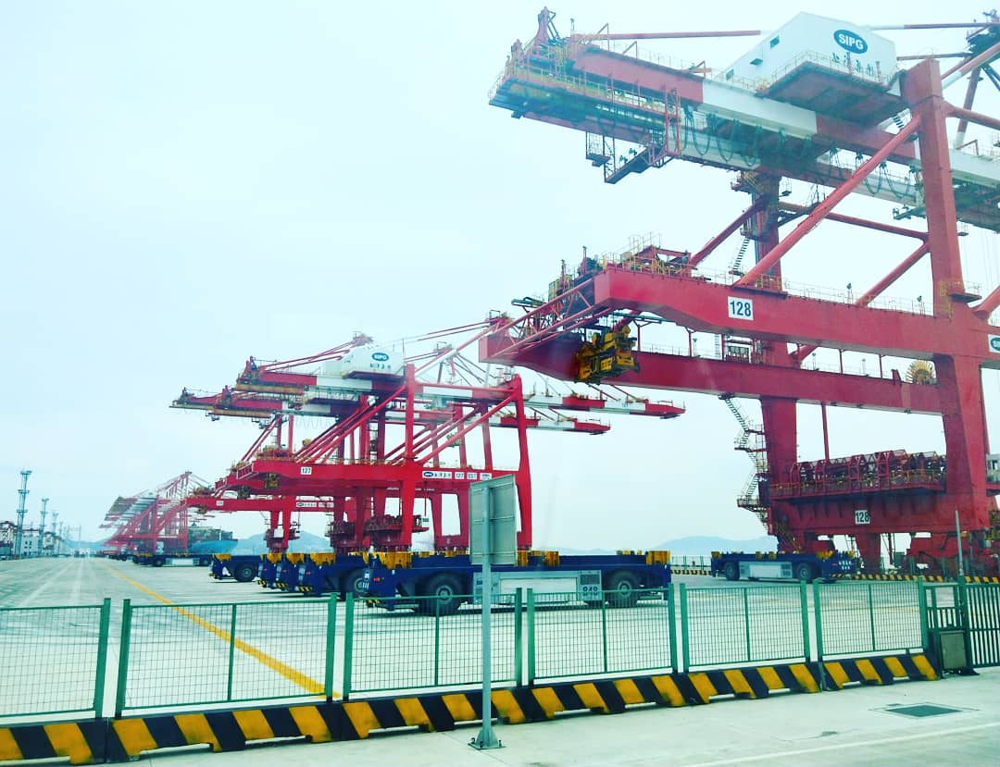

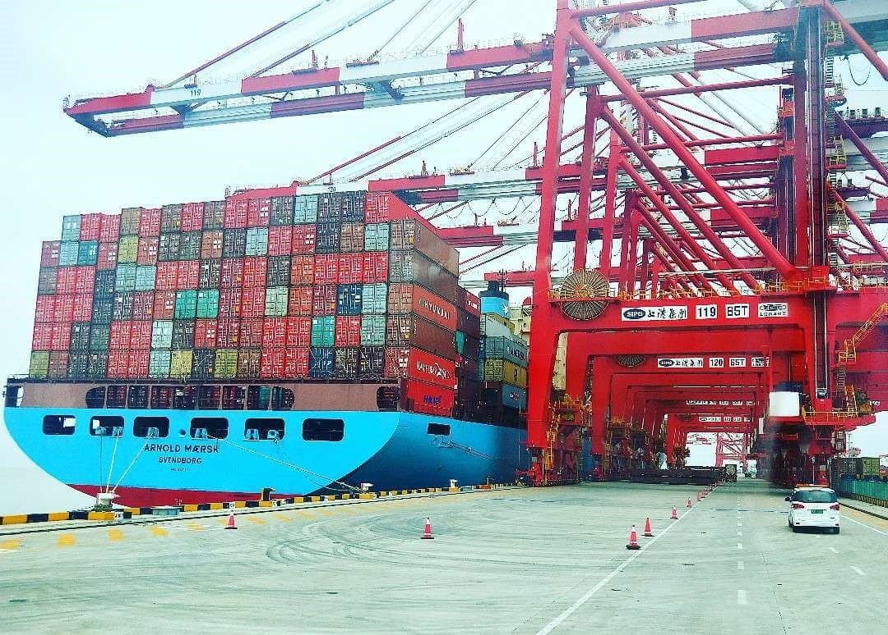

整个导航行程的末尾，我们到达了码头的近海一端，正在作业的岸桥与大型货轮让人兴致满满，可见在货轮上来自租箱公司，船运公司企业颜色，货主箱等颜色各异各种的集装箱，就不得不感叹现代物流的伟大。有人曾说，集装箱运输是有史以来一场物流领域的伟大革命，根本改变了杂货运输的面貌，它成为发展外贸不可缺的一环。而我想说的确实标准化的实现。古有秦皇统一度量衡，而今世界上有ISO，IEEE等标准化组织的标准时时刻刻规定着生产生活的进行，人类的发展才能一步步向着高效与统一发展！

同样的，在岸桥起重机与集装箱装卸方面仍然有着一些待进步的空间，如靠海停船自动化仍然需要人工操作，综上可知，即使洋山港是当今领先世界的第四代自动化码头，但科技的进步却还不能停下脚步。

#### 2.3电动AGV的运转

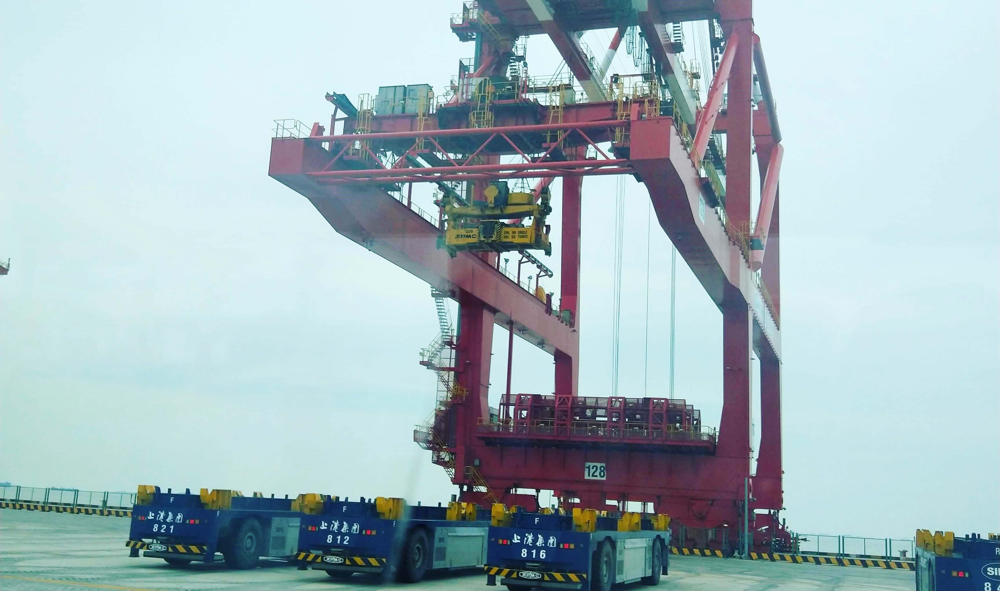

在经过岸桥与中间龙门起重机可以注意到在这井然有序的码头上其下静止与正在穿梭自主规划运动中的智能“搬运工”——自动引导运输车（AGV）。和一般的AGV一样，它可以根据预埋的磁钉实现自动导航，此外还配有智能控制系统，可以根据实时交通状况提供最优路线。除了无人驾驶、自动导航、路径优化、主动避障外，据了解，AGV小车还能自主诊断故障、监控电量。

由于整体规划，未能真正感受到AGV的另外一个神奇之处——自动充电。经过工程师预先设计的仅有一人在监护突发情况的换电自动化，使得AGV小车可以全天候不间断作业。并且洋山四期自动化码头作为全球少数几家使用全电动方案的码头，整体环保运营程度较高，自动化与无人化较好。

当然整个码头现阶段还有存在8台集卡用于内部的集装箱运输，主要是针对超限（包括长度、重量等）的集装箱在码头内的中转与运输，随着目前这一股无人驾驶浪潮的兴起，未来必将向更为自动化方向发展。

#### 2.4对自动化码头未来的预期

在工作人员的解答下，就码头管理软件方面，洋山四期自动化码头在振华重工的努力下实现了国产软件的自主化，减少了国外大多数港口对于**卡尔玛企业的[Navis 码头管理系统](https://www.kalmar.cn/automation/terminal-operating-system-tos/)**的依赖，一定程度上的自主创新，但还是未能将自由品牌推向国内与国际市场，有待进步。

此外工作人员说到，在集群AGV调度算法尤其是路径规划等问题上，国际上最大极限是80辆的自主规划，而我国现在的水平是60辆左右，未来如若要实现集体自动化仍然有较大的挑战。类似的情况还存在集装箱堆场等优化规划等问题上面。

### **3.告别**

时间短暂，也考虑到相关港口的规定较为严苛不便参观，我们登上了“洋山深水港”铭刻处远望洋山旧码头，不久同大家一起合影后，便驱车回程。透过这一个多小时的参观，让我们对目前国内乃至国际最先进的集装箱自动化有了一个简单的了解。我们深深感叹自主技术的不易，要解决知识技术自主化的问题，必须从工艺到设计都有一个比较完善的方案和体系，前面的路还有很多要走。

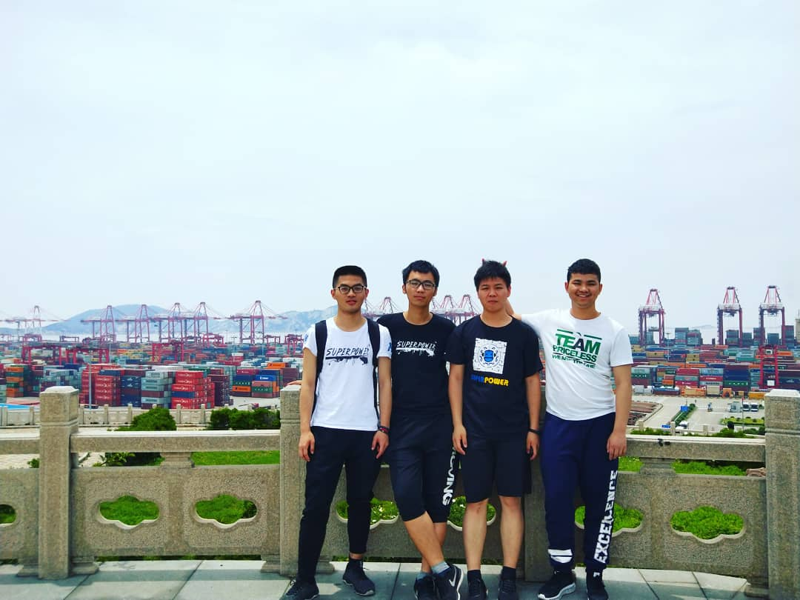

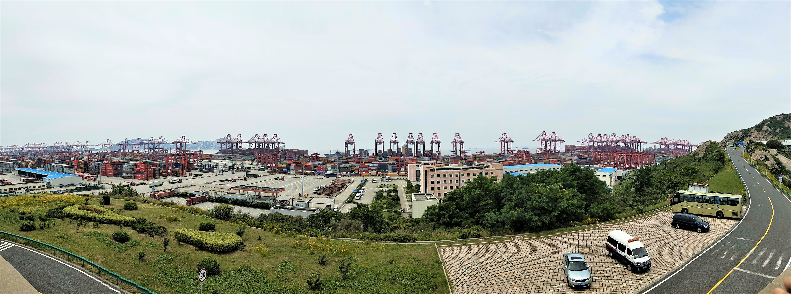

（180604）
